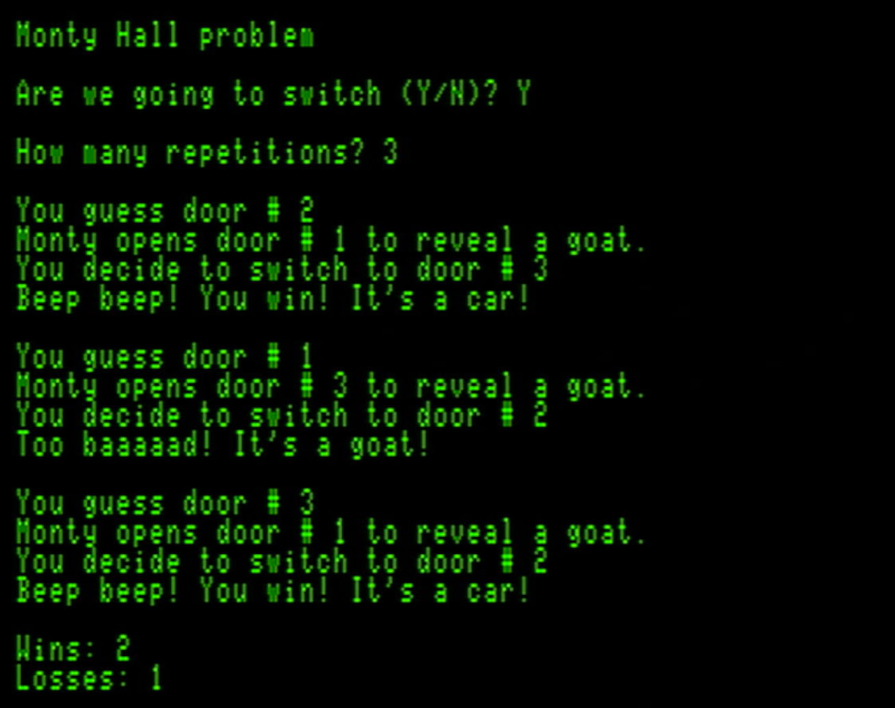

MONTY: COCO3 Monty Hall problem simulation
==========

The Monty Hall problem is a famous probability puzzle rooted in a deceptively simple game show scenario:
A contestant is presented with three doors: behind one is a prize (say, a shiny new car), and behind the other two, goats.

After the contestant picks a door, the host&mdash;Monty Hall&mdash;who _knows_ what’s behind each door, opens one of the remaining two to reveal
a goat. The contestant is then given a choice: keep the original selection, or switch to the other unopened door.

It turns out that by switching, the contestant has a 2/3 chance of winning the car, compared to 1/3 if
they stay with their original decision.

Yeah, that's not what your intuition says, and I didn't believe it either until I wrote a BASIC program for a PDP8/I computer back
in the '70s and ran a simulation a couple of thousand times.

For more historical context and mathematical breakdowns, check out the [Monty Hall problem on Wikipedia](https://en.wikipedia.org/wiki/Monty_Hall_problem).

I wrote this BASIC program for a Tandy Color Computer 3 that simulates the problem so you can check out this scenario for yourself.
I have a replica of a PDP8/I in my den; maybe I will write a version for that machine, too.

The program is written to use my BASIC preprocessor so the code can be all pretty, and the preprocessor converts it to
sensible, legal BASIC for the Coco3.  See my [preprocessor](https://github.com/yggdrasilradio/preprocessor) repository for that.

Look in the [redistribute](https://github.com/yggdrasilradio/monty/tree/master/redistribute) folder for the program in normal DECB ASCII format.

